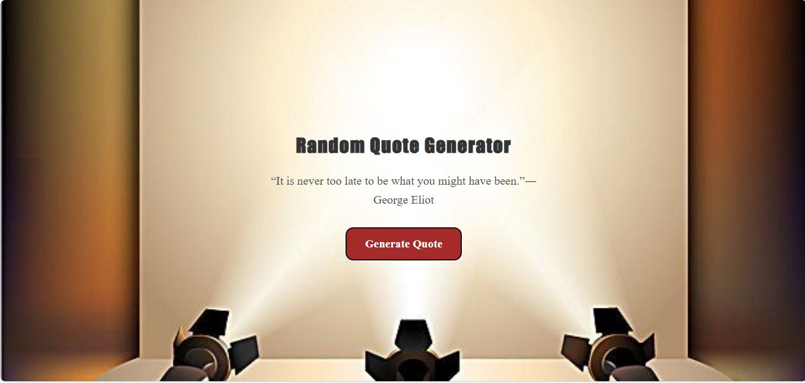

# Random Quote Generator

A simple and responsive **Random Quote Generator** built using **HTML**, **CSS**, and **JavaScript**.  
This project displays an inspirational quote each time the user clicks the "Generate Quote" button.

---

## 🚀 Features
- Generates a random quote on each click  
- Smooth and clean UI  
- Responsive layout for mobile screens  
- Stylish background with modern typography  
- Easy-to-understand JavaScript logic  

---

## How to Run the Project

1. Download or clone the repository
2. Open the folder
3. Simply open **index.html** in any browser
4. No installation or server required

---

## Live Preview

(https://random-quote-generator-proj.netlify.app/)

---

## Screenshots

---

## Author

Developed by **Ayesha Noor**.

---

If you like this project, consider giving the repo a ⭐ on GitHub!
